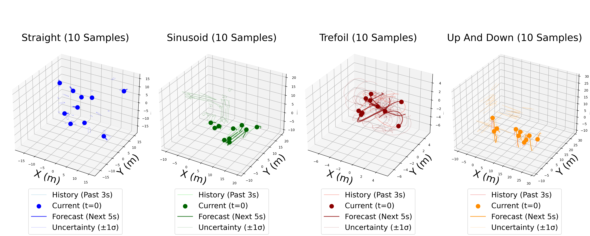

# SynTrajGen: A Synthetic Trajectory Generator for Non-Cooperative Dynamic Obstacles in UAV Navigation

**Paper:** SynTrajGen: A Synthetic Trajectory Generator for Non-Cooperative Dynamic Obstacles in UAV Navigation  
**Conference:** "Submitted to the 2025 Latin American Congress on Automation and Robotics"  
**Authors:** Syed Izzat Ullah, José Baca

---

### About This Repo

This repository contains the official implementation and dataset for the paper "SynTrajGen: A Synthetic Trajectory Generator for Non-Cooperative Dynamic Obstacles in UAV Navigation".

SynTrajGen is a parametric tool designed to generate diverse, 3D trajectories to train and benchmark forecasting models for UAV collision avoidance.

Below is an example trajectories for a few samples:

### Repository Status

**Code and dataset are pending release.**

The source code and dataset for this project will be made publicly available immediately upon the acceptance of the corresponding paper.

Thank you for your interest in our work!

For any questions, please email us at sizzatullah@islander.tamucc.edu
